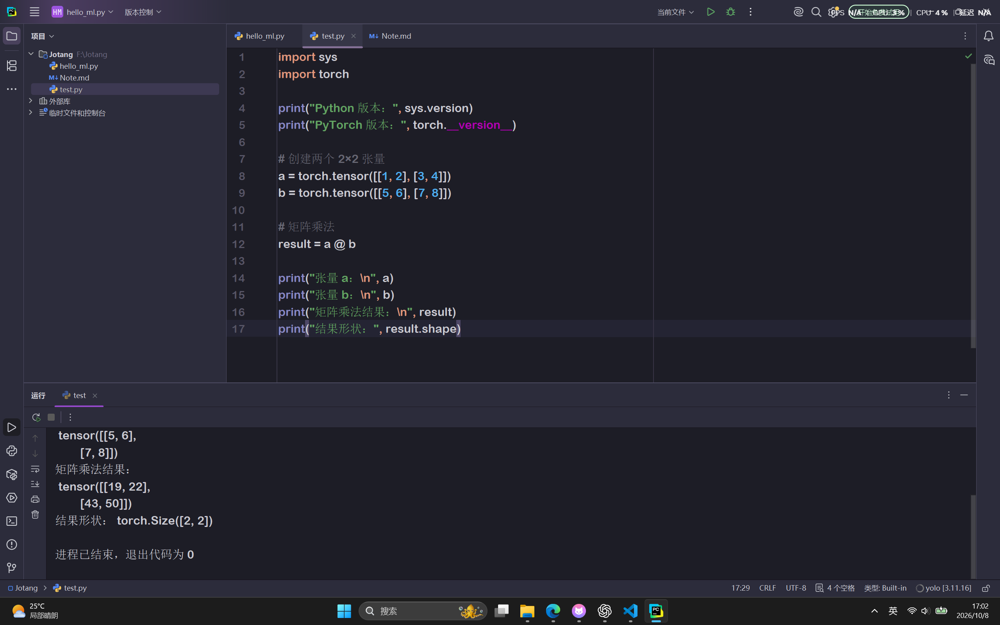
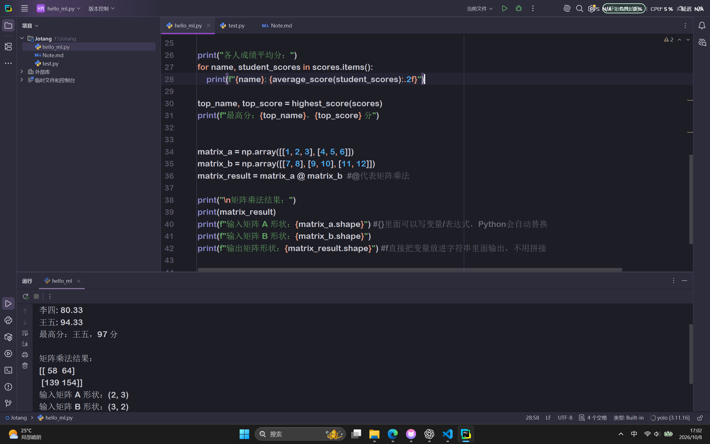

# 入门学习笔记

---

## 目录

1. [人工智能、机器学习与深度学习之间有什么关系？ ]()
2. [监督学习和无监督学习有什么区别？请各举一个例子。]()
3. [数据、特征和标签分别是什么？训练集、验证集和测试集各有什么用途？]()
4. [batch size是什么？有什么影响？]()
5. [什么是模型和模型参数？]()
6. [神经网络由哪些基本部分组成？什么是激活函数？为什么要激活函数？请介绍几种常见的激活函数。]()
7. [矩阵如何求导？提前学习该部分数学。]()
8. [怎么用矩阵乘法表示神经网络的全连接层前向传播过程？]()
9. [前向传播与反向传播分别在做什么？损失函数、梯度和学习率在训练过程中扮演什么角色？]()
10. [优化器是什么？有哪些？]()
11. [什么是过拟合，欠拟合，正则化？]()
12. [Python语法学习]()
13. [为什么不同的项目使用不同的虚拟环境]()
14. [CPU 和 GPU 各自擅长什么？训练神经网络为什么经常使用 GPU？]()
15. [CUDA 是什么？它、显卡驱动与 PyTorch 之间大致是什么关系？]()

---
## 一、关系
### 1.1人工智能 (AI)
  就是要让机器模拟人类，完成人类的的智力任务。
### 1.2机器学习 (ML)
  是人工智能的一个分支，让机器通过学习，从数据中学习规律，去完成人类的任务。
### 1.3深度学习 (DL)
  是机器学习的一个分支，让机器通过深度学习，完成人类的任务，它的核心就是神经网络。

其实就是：人工智能是大目标， 机器学习是实现人工智能的一种方法，而深度学习是用多层神经网络来实现机器学习的一种技术。

---
## 二、学习
### 2.1监督学习
  数据集中的每个数据点都包含标签，机器通过学习特征与标签的关系进行预测。
  监督学习的两类核心模型：回归模型（用于预测连续的数值型数据。模型的输出是一个具体的数值）；分类模型（用于预测离散的分类型数据，比如猫或者狗）。
### 2.2无监督学习
  数据点不包含标签，机器需要自己在数据中寻找隐藏的结构或者规律。现实生活中带标签的数据成本比较高，因此无监督学习在实际业务中也十分常见，并且主要包括三个方向：聚类（将行为模式相似的数据自动归拢到一个组），降维（在不丢失关键信息的前提下简化数据集解决特征过载的问题）与生成算法。
### 2.3强化学习
  在动态环境中通过不断地试错，学习如何做出更优决策以获得最大奖励（设置奖励和惩罚）。

---

## 三、数据
### 3.1数据：
用于训练和测试机器学习模型的原始信息。最常见的的其实是结构化数据，比如说那种表格类型的。
### 3.2特征：
表示数据的属性或性质。在表格中，特征就是表格的列。例如，假如有个房屋的数据集，每个房屋有5个特征，我们就称这个数据集的维度为5.
### 3.3标签：
模型需要重点预测的目标变量。预测，其实就是让机器通过学习特征去推算数据中的标签。
### 3.4训练集：
用来训练模型，让模型从数据中学习规律和模式。
### 3.5验证集：
用来在训练过程中评估模型，帮助做超参数调整和模型选择。（超参数就是人为提前设定，训练过程中不会自动更新的参数。比如learning rate,epoch,batch size这些）
### 3.6测试集：
用来对最后的模型性能进行测评评估。

---
# 四、batch size
## 4.1batch size
就是批次大小，每一轮迭代，一次性送入模型的样本数量。小batch的话更新频繁，震荡大。内存占用小；大batch梯度更稳，训练速度快，但需要更大的显存，容易陷入局部最优。

---
# 五、模型与参数
## 5.1模型
模型本质上就是一个从输入到输出的映射关系。比如输出一张图片，给你判断出这是猫是狗；y=f(x)，y就是输出，f是模型，x是输入。
## 5.2模型参数
模型内部那些需要从数据中学到的数值。
例如y=wx+b，w和b就是模型参数，w是weight,b是bias，一开是随机的，通过训练数据不断调整，最终变成合适的值。

---
# 六、神经网络
## 6.1 神经网络的基本组成部分
神经元，层，参数，激活函数，损失函数，优化器，前向传播，反向传播。
## 6.2 激活函数
作用在神经元输出上的函数，作用：引入非线性，假如没有激活函数，无论神经网路多少层，整个网络都只能表达线性关系，无法拟合复杂函数。
## 6.3 常见的激活函数
| 函数 | 公式 | 特点与应用场景 |
| --- | --- | --- |
| **Sigmoid** | $\sigma(x)=\dfrac{1}{1+e^{-x}}$ | 输出范围 $(0,1)$，可解释为概率；**缺点**：两端导数趋近 0，易梯度消失、输出非零中心。适合二分类输出层（与交叉熵配合）。 |
| **Tanh** | $\tanh(x)=\dfrac{e^x-e^{-x}}{e^x+e^{-x}}$ | 输出范围 $(-1,1)$，零中心化，梯度比 Sigmoid 强，但两端仍饱和。常用于早期 RNN/全连接隐藏层。 |
| **ReLU** | $\text{ReLU}(x)=\max(0,x)$ | 计算简单、正区间梯度恒为 1，缓解梯度消失、收敛快；**缺点**：负区间梯度为 0，神经元可能"死亡"。是目前默认隐藏层选择。 |
| **Leaky ReLU** | $f(x)=\max(\alpha x, x)$ | 给负区间一个很小的斜率（如 $\alpha=0.01$），缓解神经元死亡问题。 |
| **ELU / Swish / GELU** | 平滑的 ReLU 变体 | 兼顾平滑性与梯度性质，GELU 广泛用于 Transformer。 |
| **Softmax** | $\text{Softmax}(z_i)=\dfrac{e^{z_i}}{\sum_j e^{z_j}}$ | 将多个输出归一化为概率分布（和为 1），用于多分类输出层。 |

注：这个表格部分利用AI工具完成！

# 七、矩阵求导
---

# 八、矩阵乘法表示神经网络全连接层前向传播
## 单个神经元
一个神经元对x属于R
$$
z = \sum_{i=1}^{n} w_i x_i + b, \qquad a = f(z) (f是激活函数，a是该神经元的输出)
$$
## 一层全连接层
## 批量输入
## 多层堆叠

---
# 九、前向传播与反向传播
## 9.1 前向传播
沿着网络从输入到输出的过程，逐层计算，得到预测结果。
- 用当前参数W,b 计算每一层的线性组合
- 用激活函数得到每层输出
- 最终得到预测值Y
- 用损失函数衡量预测与真实标签的差距。
## 9.2 反向传播
比较预测与真实值，算出误差，逐层回传调整权重
- 从损失L出发
- 利用链式法则逐层计算每个参数的梯度
- 得到L对权重,偏置的偏导
- 为参数更新提供方向
反向传播本身不更改参数，它只算梯度。
## 9.3 损失函数
**损失函数** ：衡量模型预测值 $\hat{y}$ 与真实值 $y$ 之间的差距，是训练优化的"标尺"。损失越小，模型越接近目标。常见的损失函数有这个均方误差和交叉熵损失。
## 9.4 梯度
**梯度** ：告诉参数往哪走，它表示损失在参数空间中增长最快的方向，负梯度方向就是损失下降最快的方向，梯度的大小则反映了参数对损失的敏感程度。
## 9.5 学习率
**学习率**：学习率决定步长，学习率过大可能导致在最优点周围震荡，损失不稳定。学习率过小则可能训练时间过长，也可能留在较差区域。因此我们可以在前期用较大的学习率快速探索，后期用较小的学习率来精细收敛。

---
# 十、优化器
**优化器** ：训练神经网络时，用来根据损失函数和梯度更新模型参数的算法。
| 优化器 | 对训练效果的作用 |
| --- | --- |
| **SGD** | 基础更新方式，简单通用，收敛依赖学习率设置。 |
| **Momentum** | 加速沿稳定方向的收敛，减少震荡。 |
| **Nesterov（NAG）** | 先"预看"一步再计算梯度，收敛更快、更稳。 |
| **AdaGrad** | 自动为稀疏特征分配较大学习率，适合 NLP 中的稀疏数据。 |
| **RMSProp / AdaDelta** | 解决 AdaGrad 学习率骤减问题，适合非平稳目标。 |
| **Adam / AdamW** | 自适应学习率 + 动量，几乎免调参、收敛快，是最主流的默认选择；AdamW 将权重衰减与梯度更新解耦，训练 Transformer/大模型更稳定。 |

注：此表格格式由AI完成

---
# 十一、过拟合、欠拟合、正则化
## 11.1 过拟合
训练数据学的太细了，连噪声也学会了。模型在训练集上表现很好，但在没见过的测试集或验证集上表现较差。常见的对应方法是:增加训练数据，数据增强，减小模型，使用正则化或提前终止训练。
## 11.2 欠拟合
模型连训练数据中的主要规律都没学好。模型在训练集和验证集的表现较差。可能是模型太简单，训练不足，或正则化太强，可以针对原因增强模型能力、延长训练或减弱约束。
## 11.3 正则化
训练时加入约束，防止过拟合。常见的正则化方法有L1正则化、L2正则化、Dropout、权重衰减等。
**L1、L2正则化**：在损失中加入参数惩罚，限制模型复杂度；L1 常使部分参数变为零，L2 倾向于让参数更小。
**Dropout**：训练时随机停用一部分神经元，减少模型对特定神经元组合的依赖。
**Early Stopping（早停）**：验证集表现不再改善时停止训练，避免继续贴合训练数据。

---

# 十二、Python语法学习




## 1.列表
**列表**：把多个数据放在一起，[]表示列表，里面的数据用逗号隔开，可以通过索引取出数据，从0开始计数。
eg.print(score[0]) #输出第一个数据(#后是注释不会运行)
## 2.字典
**字典**：dict 通过名称找到对应数据。{}表示字典，每一项写成key:value的形式，key是名称，value是数据，通过key来取出数据。
eg.print(score["李四"])
.items()可以取出字典中的所有数据。
## 3.def
**def**: 定义函数，def:函数名（参数）函数内部代码。
## 4.元组
**元组**：tuple，和列表一样储存多个数据，但创建后不能直接添加，删除或替换其中的元素。用（）。还可以把元组拆包
``` bash
student = ("张三", 90)

name, score = student

print(name)   # 张三
print(score)  # 90
```

# 十三、虚拟环境
## 使用不同虚拟环境的原因
  不同项目使用不同的虚拟环境，可以避免依赖冲突，虚拟环境可以给每个项目创建一个独立的房间，避免版本冲突，防止环境变得混乱，方便复现项目，降低升级风险，当升级某个项目的库时，不会破坏其他项目。

---
# 十四、CPU与GPU
## 14.1 CPU
  中央处理器，是计算机的运算和控制核心，负责处理计算机内部的数据，控制计算机各个硬件模块的工作。CPU擅长复杂逻辑判断，分支运算，串行任务，通用性强，但处理大量数据时效率较低。
## 14.2 GPU
  图形处理器，是显卡上的处理器，负责处理图形运算，如渲染、图像处理等.GPU擅长大量简单的并行运算，可以同时处理海量相同类型的数学运算。
## 14.3 为什么用GPU
**1.** 神经网络训练本质是大规模矩阵运算,全连接层、卷积层、注意力机制，核心都是矩阵乘法、逐元素运算。这些运算可以拆成成千上万个互不依赖的小计算，天然适合 GPU 的数千个核心并行处理。
**2.** GPU 的并行吞吐量远超 CPU,CPU 通常几十个核心，GPU 有几千个流处理器。虽然 GPU 单核弱，但训练时更看重“单位时间完成多少浮点运算”，GPU 的 FLOPS 往往比同代 CPU 高一个数量级以上。
**3.** 训练需要反复迭代，计算量巨大,前向传播、反向传播、参数更新要重复数百万次。用 CPU 串行做，时间不可接受；用 GPU 并行做，能把训练时间从几周缩到几小时。
# 十五、 CUDA是什么？它，显卡驱动，与Pytorch的关系
## 15.1 CUDA(Compute Unified Device Architecture)
**CUDA** 是 NVIDIA 推出的通用并行计算平台和编程模型。它让开发者能用 C/C++/Python 等语言，把计算任务写到 NVIDIA GPU 上执行，而不只是用来画图。主要包含编程模型、运行时/驱动API，数学库，编译器等。
## 15.2 关系
**显卡驱动**：是操作系统和 GPU 硬件之间的底层桥梁。它负责：
- 让系统识别 GPU、管理显存、电源、显示输出；
- 提供底层接口，让 CUDA 运行时能真正把指令发给 GPU；
- 决定这块卡“能不能被 CUDA 用、支持到哪个 CUDA 版本”

**Pytorch**: 是上层的深度学习框架。它本身不直接操作 GPU 硬件，而是：
- 用 CUDA（以及 cuDNN、cuBLAS 等库）来实现 GPU 上的张量运算和神经网络算子；
- 通过 CUDA 运行时/驱动，把计算任务下发到 GPU；
- 给用户提供 tensor.cuda()、torch.cuda 这类简单接口。

显卡驱动让 GPU 能被系统使用；CUDA 在驱动之上提供通用 GPU 计算能力；PyTorch 再在 CUDA 和 cuDNN 等库之上，提供深度学习框架。训练时，写 PyTorch 代码，PyTorch 调 CUDA 库，CUDA 通过驱动把任务发给 GPU 执行。


